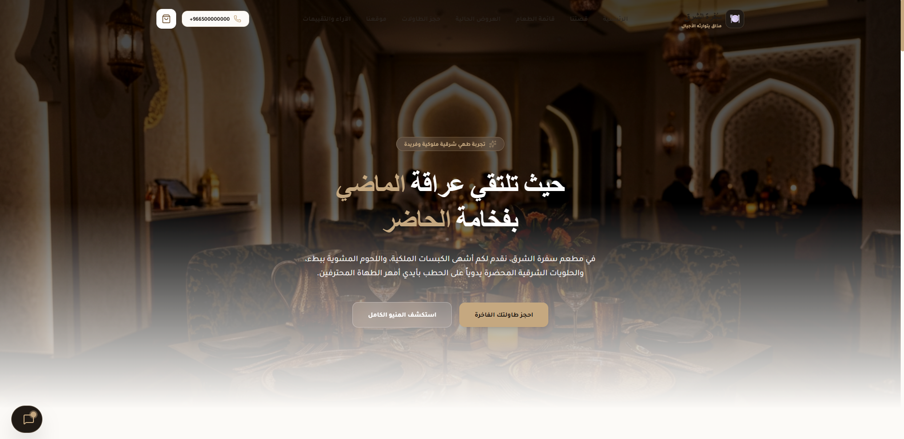
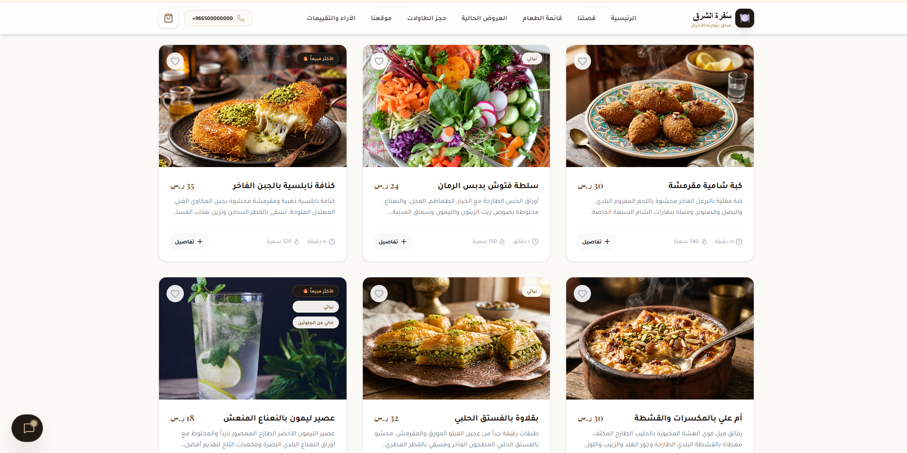

# 🍽️ Sofra Restaurant Landing Page

A modern and responsive Arabic restaurant landing page built with **React**, **Vite**, and **Tailwind CSS**.

##  Features

* Responsive design for all devices
* Modern Arabic UI/UX
* Interactive food menu sections
* Table reservation section
* Special offers section
* Social media integration
* AI-powered restaurant assistant (Chef Saeed)

##  Live Demo

 **Website:**
https://sofra-restaurant1.vercel.app/

##  Website Preview

###  Hero Section

  

---

###  Menu Section

  

